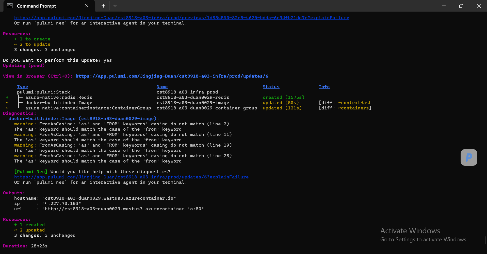

# CST8918 Hybrid-H03 Pulumi Weather App

## Group Name

Group 3

## Team Members

* Jingjing Duan (Student ID: 041159829)
* Khalid Amchat (Student ID: 041125350)

## Project Overview

This assignment extends the Lab-A03 Pulumi Weather App by improving security and scalability. The OpenWeather API key is securely managed using Pulumi Secrets, and the application cache is migrated from an in-memory implementation to a shared Redis cache hosted on Azure Cache for Redis.

## Hybrid-H03 Objectives

* Secure the OpenWeather API key using Pulumi Secrets.
* Replace the in-memory cache with Redis.
* Create and configure Azure Cache for Redis.
* Inject the Redis connection string into the application container.
* Update and redeploy the application using Pulumi.
* Verify the deployment in Azure.

## Technologies Used

* Pulumi
* TypeScript
* Azure Container Registry
* Azure Container Instances
* Azure Cache for Redis
* Docker
* Remix
* Redis
* OpenWeather API

## Azure Resources Created

* Resource Group
* Azure Container Registry
* Azure Container Instance / Container Group
* Azure Cache for Redis
* Docker image stored in ACR
* Public DNS endpoint

## Deployment Screenshot

The Redis-enabled Remix Weather application was successfully deployed to Azure.

Screenshot: [pulumi-output.png](./pulumi-output.png)



## Team Contributions

### Jingjing Duan

* Configured Pulumi Secret management for the OpenWeather API key.
* Provisioned Azure Cache for Redis using Pulumi.
* Generated the Redis connection string and configured the REDIS_URL environment variable.
* Updated and redeployed Azure infrastructure.
* Verified deployment and captured deployment output.

### Khalid Amchat

* Installed and configured the Redis client library.
* Created the Redis connection module.
* Updated the weather service to use Redis caching.
* Tested Redis integration in the local development environment.
* Updated the application container image version.

## How to Deploy

From the `infrastructure` folder:

```bash
pulumi up
```

## Clean Up

When the deployment is no longer needed:

```bash
pulumi destroy
```
