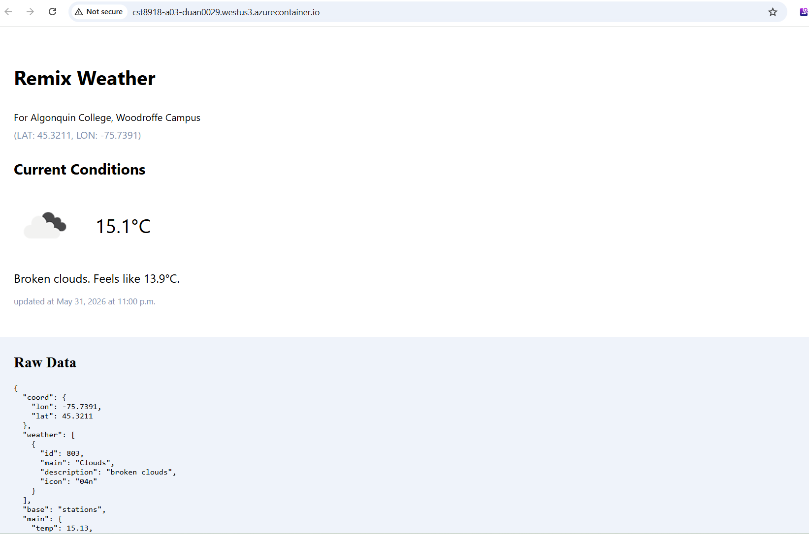

# CST8918 Lab-A03 / Hybrid-H03

## Group Name
Group 3

## Team Members
- Jingjing Duan
- Khalid Amchat (Student ID: 041125350)

## Lab-A03 Team Contributions
### Jingjing Duan
- Pulumi project initialization
- Azure Resource Group
- Azure Container Registry (ACR)
- Docker image build and deployment

### Khalid Amchat
- Azure Container Instance (ACI)
- Public endpoint configuration
- Redis integration
- Final deployment testing

## Hybrid-H03 Team Contributions
### Jingjing Duan
- Pulumi Infrastructure
- Azure Container Registry
- Azure Container Instance
- Azure Cache for Redis
- Secret Management

### Khalid Amchat
- Redis Client Integration
- Application Code Changes
- Cache Logic Implementation
- Local Testing
- Application Validation

## Screenshots
- Remix Weather app deployed on Azure : [lab-a03.png](./lab-a03.png)

- pulumi-output.png

## Public URL Repo
https://github.com/Jingjing-Duan/cst8918-a03-h03-pulumi-weather/tree/lab-a03
